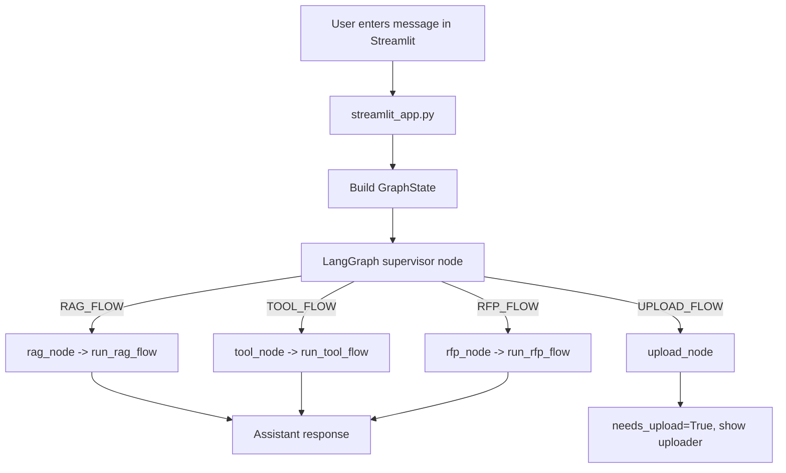

# End-to-End Architecture

This document explains how the repository works end to end: from user question in Streamlit to graph routing, agent execution, retrieval/tool usage, and logging.

## 1. Repository Map

- `app/ui/streamlit_app.py`
  - Main UI entrypoint.
  - Accepts user input, invokes graph, renders assistant response, handles upload widget.
- `app/graph/`
  - `graph.py`: builds LangGraph nodes + edges.
  - `nodes.py`: node handlers (`supervisor`, `rag`, `tool`, `rfp`, `upload`).
  - `router.py`: intent classifier that decides which flow runs.
  - `state.py`: shared graph state (`GraphState`).
- `app/agents/`
  - `rag_flow.py`: Retrieval-Augmented generation path.
  - `tool_flow.py`: SQLite-backed incident/request tools.
  - `rfp_flow.py`: Enterprise proposal generation path with optional uploaded document context.
- `app/rag/`
  - `loaders.py`: loads PDFs from `kb_pdfs/`.
  - `build_index.py`: chunks docs, embeds, builds FAISS index.
  - `retriever.py`: runtime FAISS similarity search.
- `app/db/`
  - `init_db.py`: creates SQLite tables.
  - `seed_db.py`: inserts sample incidents and service requests.
  - `repository.py`: DB read access.
  - `db.py`: SQLite connection and DB path.
- `app/tools/local_tools.py`
  - Tool wrapper methods for open incidents/open service requests.
- `app/core/`
  - `config.py`: env-driven model config.
  - `llm.py`: ChatOllama client creation.
  - `logger.py`: unified stdout logger format.
- `app/prompts/`
  - `prompts.json`: base prompt templates (supervisor/rag/rfp).

## 2. Runtime Flow (High Level)

## 3. Detailed Request Lifecycle

### Step 1: UI receives question

File: `app/ui/streamlit_app.py`

1. `st.chat_input()` captures text.
2. A `request_id` is generated (UUID short form) for traceability.
3. `GraphState` is created with:
   - `user_input`
   - `request_id`
   - `uploaded_file` (if user uploaded a PDF earlier)
4. `graph.invoke(state)` runs the LangGraph.

### Step 2: Supervisor classifies intent

Files: `app/graph/nodes.py`, `app/graph/router.py`

1. `supervisor_node` calls `classify_intent(user_input, has_uploaded_file=...)`.
2. `router.py` uses deterministic keyword hints first:
   - Tool hints -> `TOOL_FLOW`
   - RFP hints -> `RFP_FLOW`
   - Explicit upload/doc-action intents -> `UPLOAD_FLOW` or `RFP_FLOW` (if file already uploaded)
3. If ambiguous, it can fall back to LLM prompt classification.
4. `state.intent` is set.

### Step 3: Graph routing

File: `app/graph/graph.py`

- Conditional edges map:
  - `RAG_FLOW` -> `rag`
  - `TOOL_FLOW` -> `tool`
  - `RFP_FLOW` -> `rfp`
  - `UPLOAD_FLOW` -> `upload`
- Each terminal node ends at `END`.

### Step 4: Selected agent executes

#### A) RAG path

Files: `app/agents/rag_flow.py`, `app/rag/retriever.py`

1. `query_rag(user_input)` runs FAISS similarity search (`k=4`).
2. Retrieved chunk texts are concatenated as context.
3. Prompt forces answer from context only.
4. LLM returns final answer stored in `state.response`.

#### B) TOOL path

Files: `app/agents/tool_flow.py`, `app/tools/local_tools.py`, `app/db/repository.py`

1. Agent checks text:
   - If contains `"request"` -> `get_open_service_requests()`
   - Else -> `get_open_incidents()`
2. Tool reads full list from SQLite repository.
3. Tool filters non-closed records.
4. Agent formats response bullets and sets `state.response`.

#### C) RFP path

File: `app/agents/rfp_flow.py`

1. Determines if uploaded document context should be used.
2. If relevant and file exists:
   - Reads PDF via `pypdf.PdfReader`.
   - Extracts text up to `max_chars=12000`.
3. Builds enterprise proposal prompt with assumptions/clarification guidance.
4. LLM generates proposal response -> `state.response`.

#### D) Upload path

File: `app/graph/nodes.py`

1. Sets:
   - `state.needs_upload = True`
   - `state.response = "Please upload your RFP PDF."`
2. Streamlit sees `needs_upload=True` and renders `st.file_uploader`.
3. Uploaded file is saved to `temp_uploads/` and stored in session state.

### Step 5: UI response rendering

File: `app/ui/streamlit_app.py`

1. UI reads result fields (`intent`, `needs_upload`, `response`).
2. Assistant response is shown immediately.
3. Response preview is also written to terminal logs.
4. Chat history is appended in `st.session_state.messages`.

## 4. RAG Data Pipeline (Chunking + FAISS)

### Offline/index-time flow

Files: `app/rag/loaders.py`, `app/rag/build_index.py`

1. Load all PDFs from `kb_pdfs/` with `PyPDFLoader`.
2. Chunk using `RecursiveCharacterTextSplitter`:
   - `chunk_size=1000`
   - `chunk_overlap=200`
3. Generate embeddings using `OllamaEmbeddings(model="nomic-embed-text")`.
4. Build FAISS vector store from chunks.
5. Persist index to `app/rag/faiss_index/` (`index.faiss`, `index.pkl`).

### Online/query-time flow

File: `app/rag/retriever.py`

1. Load persisted FAISS index on module import.
2. On query, run `similarity_search(query, k=4)`.
3. Return joined page-content text to RAG agent prompt.

## 5. Tool + Database Architecture

### DB schema

Files: `app/db/init_db.py`, `app/db/database.db`

Tables:
- `incidents(id, title, severity, team, status, created_at)`
- `service_requests(id, department, request_type, status, created_at)`

### Data access layers

1. `repository.py`: raw table reads -> typed Pydantic objects (`Incident`, `ServiceRequest`).
2. `local_tools.py`: business filters for open records.
3. `tool_flow.py`: user-facing response formatting and branching logic.

## 6. Prompt + Model Layers

### Config

File: `app/core/config.py`

Environment variables:
- `OLLAMA_MODEL` (default `llama3.2:latest`)
- `EMBED_MODEL` (default `nomic-embed-text`)
- `TEMPERATURE` (default `0.2`)

### LLM creation

File: `app/core/llm.py`

- Uses `ChatOllama(model=Settings.MODEL, temperature=Settings.TEMPERATURE)`.

### Prompt sources

Files: `app/prompts/prompts.json`, `app/prompts/prompt_loader.py`

- Supervisor prompt exists for classification fallback.
- RAG and RFP prompts are constructed mainly in agent files with runtime context.

## 7. Logging and Observability

### Logger configuration

File: `app/core/logger.py`

- Logger name: `agent`
- Output: stdout stream
- Format: `timestamp | level | logger | message`
- Level: `INFO`

### Where logs are produced

- UI level (`streamlit_app.py`)
  - incoming user message
  - graph completion summary
  - assistant response preview
  - upload file metadata
- Graph level (`nodes.py`, `router.py`, `graph.py`)
  - node enter/exit
  - dispatch decisions
  - intent hint matches + route reasons
  - graph topology
- Agent/tool/retriever level
  - selected tool
  - retrieved doc counts/chars
  - elapsed timings
  - sample IDs for tool outputs

### Example log chain for `show open incidents`

1. `Incoming user message`
2. `node=supervisor | enter`
3. `Intent classifier inputs ...`
4. `route=TOOL_FLOW`
5. `node=tool | dispatch_agent=run_tool_flow`
6. `selected_tool=get_open_incidents`
7. `tool=get_open_incidents | raw_count=...`
8. `tool=get_open_incidents | filtered_count=...`
9. `agent=tool_flow | done | result_count=...`
10. `Graph completed ...`
11. `Assistant response preview=...`

## 8. Flow Examples (User -> Route)

- `show open incidents` -> `TOOL_FLOW`
- `show open requests` -> `TOOL_FLOW`
- `Draft proposal for cloud migration` -> `RFP_FLOW`
- `Write RFP response for scalable architecture` -> `RFP_FLOW`
- `I want to upload an RFP` -> `UPLOAD_FLOW`
- `Summarize my uploaded document`:
  - no uploaded file -> `UPLOAD_FLOW`
  - uploaded file present -> `RFP_FLOW` with document context
- Generic knowledge question (no specific hints) -> `RAG_FLOW`

## 9. Important State Fields

File: `app/graph/state.py`

- `user_input`: current user message
- `request_id`: trace id for logs
- `intent`: chosen graph route
- `response`: assistant output
- `uploaded_file`: uploaded PDF path (if any)
- `needs_upload`: UI flag to display upload control

## 10. Entry Commands (Execution Paths)

- Main app: `poetry run streamlit run app/ui/streamlit_app.py`
- Build DB schema: `poetry run python -m app.db.init_db`
- Seed DB: `poetry run python -m app.db.seed_db`
- Build FAISS index: `poetry run python -m app.rag.build_index`
- Export Mermaid graph: `poetry run python -m app.graph.export_mermaid`
