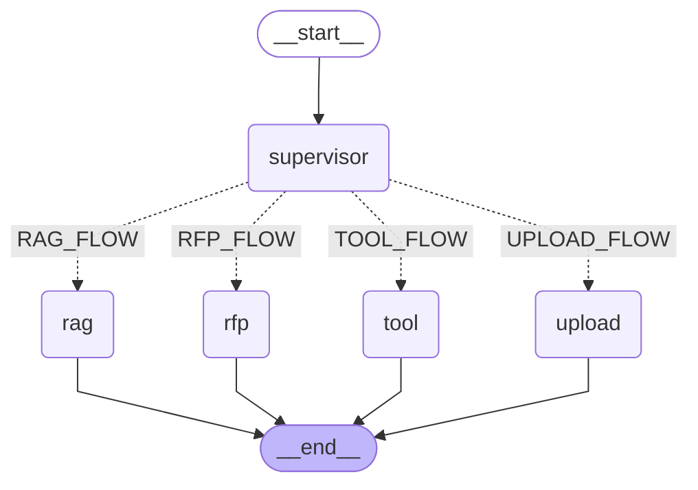

# Capstone Project Agentic AI RAG

## Documentation

- [Setup Guide](SETUP.md)
- [End-to-End Architecture](ARCHITECTURE.md)

## Graph Flow (Mermaid)



Generated source: `docs/graph_flow.mmd`

To regenerate after graph changes:

```bash
poetry run python -m app.graph.export_mermaid
```
