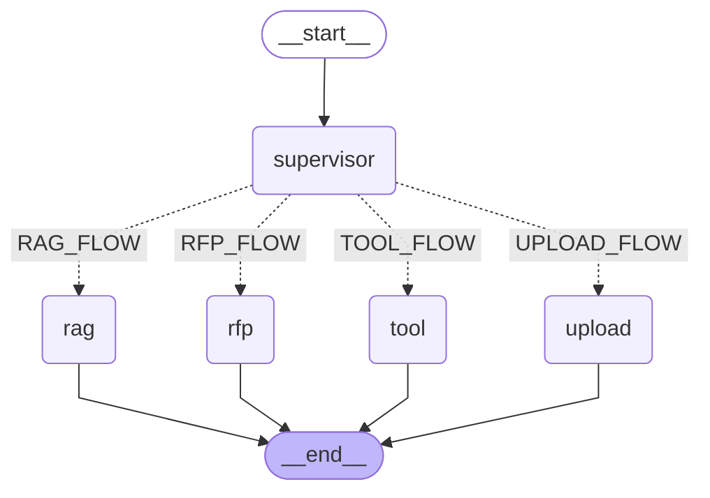

# Capstone Project Agentic AI RAG

## Documentation

- [Setup Guide](SETUP.md)
- [End-to-End Architecture](ARCHITECTURE.md)
- [Cloud Deployment + Qdrant Ingestion](docs/streamlit_cloud_qdrant.md)

## Runtime Modes

- `APP_ENV=local`
  - LLM: Ollama (`OLLAMA_MODEL`)
  - Embeddings: Ollama (`EMBED_MODEL`)
  - Vector store: local FAISS (`LOCAL_FAISS_PATH`)
- `APP_ENV=cloud`
  - LLM: Gemini (`GEMINI_CHAT_MODEL`, `GOOGLE_API_KEY`)
  - Embeddings: Gemini (`GEMINI_EMBED_MODEL`)
  - Vector store: Qdrant Cloud (`QDRANT_URL`, `QDRANT_API_KEY`, `QDRANT_COLLECTION`)

Use `.env.example` as the config template.

Cloud ingestion (`python -m app.rag.ingest_qdrant`) now includes:
- PDFs (`kb_pdfs/`)
- synthetic dataset (`SYNTHETIC_DATA_PATH`)
- SQLite seed data (`incidents`, `service_requests`)

It uses deterministic point IDs for true upsert on reruns (no duplicates).

## Graph Flow (Mermaid)


```mermaid
---
config:
  flowchart:
    curve: linear
---
graph TD;
    __start__([<p>__start__</p>]):::first
    supervisor(supervisor)
    rag(rag)
    tool(tool)
    rfp(rfp)
    upload(upload)
    __end__([<p>__end__</p>]):::last
    __start__ --> supervisor;
    supervisor -. &nbsp;RAG_FLOW&nbsp; .-> rag;
    supervisor -. &nbsp;RFP_FLOW&nbsp; .-> rfp;
    supervisor -. &nbsp;TOOL_FLOW&nbsp; .-> tool;
    supervisor -. &nbsp;UPLOAD_FLOW&nbsp; .-> upload;
    rag --> __end__;
    rfp --> __end__;
    tool --> __end__;
    upload --> __end__;
    classDef default fill:#f2f0ff,line-height:1.2
    classDef first fill-opacity:0
    classDef last fill:#bfb6fc
```

Generated source: `docs/graph_flow.mmd`

To regenerate after graph changes:

```bash
poetry run python -m app.graph.export_mermaid
```
